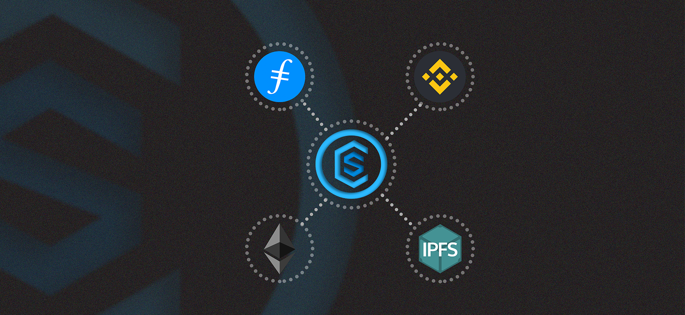

# cassava-ui
User interface for the CassavaSwap protocol

# NFT Marketplace
Our NFT marketplace will allow a user to mint NFT single item or collection deploy to Binance smart chain and IPFS.
Currently the NFT valuation of CassavaSwap uses a basic simple algorithm to determine a fair price for an asset, this include;
- Medium of storage
 - Decentralized or centralized
- Contract blockchain
- Analyse if meta data include any social link
- Still thinkering around it...

# Receipt Attestation
This will allow merchants to mint receipt for physical products to the IPFS storage giving a user a perpetual storage, user can securely access all his/her receipt using phone number or email with OTP.
To add a level of privacy the receipt data such as name, address, phone number maybe encrypted using any one way hash algorithm such as SHA256 or KECCAK256 hash.

...Work in progress
